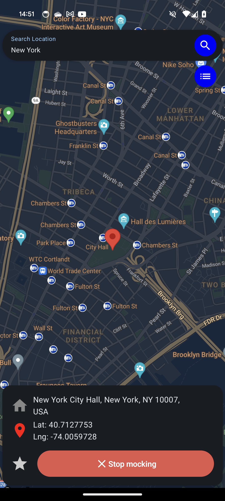
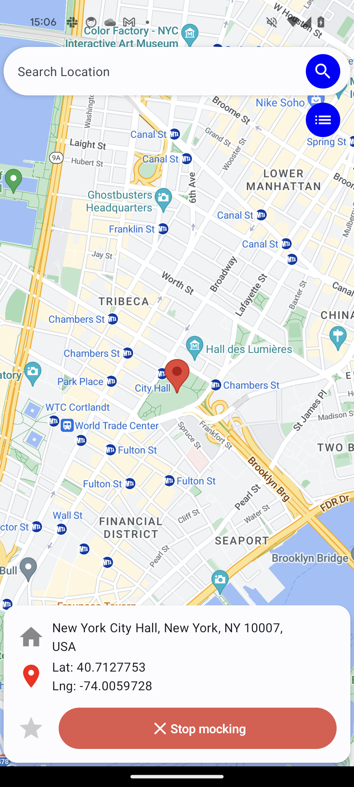

# MockGPS App for Android

### All support is greatly appreciated
https://buymeacoffee.com/lilstiffy

### Feel free to request features in order to make the app even better!

## Overview

This Android app allows users to mock their device's location, providing a convenient way to simulate different geographic locations. It can be useful for testing location-based features in various applications or for other scenarios where mock location data is required.

## Features

- **Mock Location:** Set a custom latitude and longitude to simulate the device's location.
- **Real-Time Updates:** Update the mock location in real-time for dynamic testing scenarios.
- **Permissions:** Ensure that the app has the necessary location-related permissions to function correctly.
- **Easy-to-Use Interface:** Simple user interface.

## Getting Started

### Prerequisites

- Developer mode and the MockGPS selected as selected Mock Location app.
- Android Studio for building and running the app (optional).

### Installation

1. Clone the repository or download the APK file.
   ```bash
   git clone https://github.com/lilstiffy/mock-location-app.git

### Screenshots (Dark / Light)


